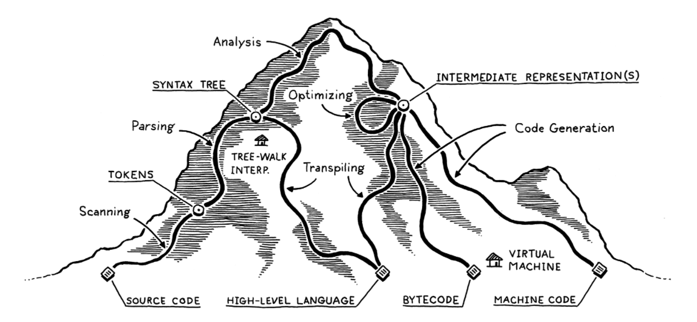

# Map of the territory

## Scanning
Also known as **Lexing** or **Lexical Analysis**

Takes in a stream of characters and converts them into **tokens**.

## Parsing

Here, we establish the grammar - compose larger expressions and statements out of smaller parts.

A **Parser** build a tree structure. Trees are known as **parse tree, Abstract syntax tree (AST) or Syntax tree**

## Static Analysis

Here we do the **binding** or **resolution**. What does a + b mean ? In this stage we wire the name a and b with what they repersent. We check the scope.

This additional information needs to be kept somewhere.
We can keep it in:
* the tree as **attributes**
* cast it aside in a table called **symbol table**
* convert the tree into a different data structure

### Intermediate representation

In the middle, the code may be stored in some intermediate representation (IR) that isn’t tightly tied to either the source or destination forms (hence “intermediate”)